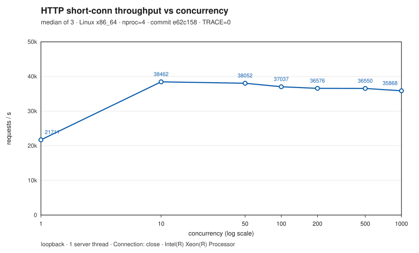
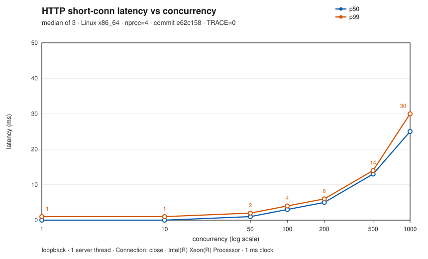

[中文](readme.md) | **English**

sthread
---

[](https://github.com/linkxzhou/sthread/actions/workflows/build-ubuntu-22.04.yml)
[](https://github.com/linkxzhou/sthread/actions/workflows/build-ubuntu-24.04.yml)
[](https://github.com/linkxzhou/sthread/actions/workflows/build-ubuntu-24.04-arm.yml)
[](https://github.com/linkxzhou/sthread/actions/workflows/build-macos-14.yml)
[](https://github.com/linkxzhou/sthread/actions/workflows/build-macos-15.yml)
[](https://github.com/linkxzhou/sthread/actions/workflows/build-macos-15-intel.yml)
[](https://github.com/linkxzhou/sthread/actions/workflows/build-macos-26.yml)
[](https://github.com/linkxzhou/sthread/actions/workflows/build-android.yml)
[](https://github.com/linkxzhou/sthread/actions/workflows/format.yml)

# Introduction

[sthread](https://github.com/linkxzhou/sthread) is a high-performance, coroutine-based networking library written in **C++98** that provides non-blocking TCP/UDP client and server capabilities.

The final deliverable is a library: `libmthread.a` / `libmthread.so`. Consumers only need to link against it.

# Features

1. No dependency on any third-party runtime library
2. Multi-platform coroutine scheduling (ucontext + `asm.S`: 386 / amd64 / mips / power / **arm64**). Android (arm64-v8a and x86_64) uses the vendored libtask asm (ELF symbols) plus epoll
3. Supports epoll (Linux / Android) and kqueue (macOS / OpenBSD)
4. No asynchronous scheduling code to write: business logic is written entirely in synchronous style, and the framework handles asynchrony internally
5. Provides non-blocking TCP / UDP clients (short-lived connections and TCP keepalive reuse)
6. Cross-platform; with enough memory and file handles, a large number of coroutines can be created (see "Performance" below)
7. Easy to use: just link a single `libmthread.a` or `libmthread.so`

Example applications: `app/st_dns`, `app/st_memcacheclient`, `app/st_wrk`, `app/st_httpserver`, `app/st_dnsserver`, `app/st_httpclient`.

# Requirements

| Item | Details |
| --- | --- |
| Language standard | C++98 (`-std=c++98`) |
| Linux | g++; epoll backend; glibc `get/make/swapcontext` |
| macOS | clang++; kqueue backend; **real ucontext supported on Apple Silicon** |
| Android | NDK clang; API 21; **arm64-v8a and x86_64**; epoll plus vendored libtask asm. Cross-compile only; tests are not run on an emulator. armeabi-v7a / x86 are not supported |
| Runtime dependencies | None (system libraries only: libc / libstdc++ or libc++ / libpthread / libdl) |
| Optional development-time dependencies | gperftools (tcmalloc / profiler), off by default; see [`thirdparty/readme.md`](thirdparty/readme.md) |

# Build Status

On every push / PR, [GitHub Actions](https://github.com/linkxzhou/sthread/actions) builds stlib, libmthread, the apps, and all tests on the platforms below, and runs `stlib/tests`; the unittests in `tests/` are currently non-blocking. Each platform has its own workflow (`.github/workflows/build-*.yml`; POSIX platforms share `_build.yml`), plus `format.yml` for clang-format-18 format checking. Android uses a separate `build-android.yml` and is cross-compiled only.

| Platform | Architecture | Compiler | Status |
| --- | --- | --- | --- |
| Ubuntu 22.04 | x86_64 | g++ / clang++ | [](https://github.com/linkxzhou/sthread/actions/workflows/build-ubuntu-22.04.yml) |
| Ubuntu 24.04 | x86_64 | g++ / clang++ | [](https://github.com/linkxzhou/sthread/actions/workflows/build-ubuntu-24.04.yml) |
| Ubuntu 24.04 | arm64 (aarch64) | g++ / clang++ | [](https://github.com/linkxzhou/sthread/actions/workflows/build-ubuntu-24.04-arm.yml) |
| macOS 14 | arm64 | Apple clang++ | [](https://github.com/linkxzhou/sthread/actions/workflows/build-macos-14.yml) |
| macOS 15 | arm64 | Apple clang++ | [](https://github.com/linkxzhou/sthread/actions/workflows/build-macos-15.yml) |
| macOS 15 | x86_64 (Intel) | Apple clang++ | [](https://github.com/linkxzhou/sthread/actions/workflows/build-macos-15-intel.yml) |
| macOS 26 | arm64 | Apple clang++ | [](https://github.com/linkxzhou/sthread/actions/workflows/build-macos-26.yml) |
| Android | arm64-v8a, x86_64 (NDK, API 21, build only) | NDK clang++ | [](https://github.com/linkxzhou/sthread/actions/workflows/build-android.yml) |

## Apple Silicon (arm64)

- Implementation: `stlib/ucontext/ucontext-arm64.h` + `asm.S` (`NEEDARM64CONTEXT`)
- Symbols: `makecontext` / `swapcontext` are renamed to `libthread_*` to **avoid** the same-named functions in Apple `libsystem` (their layout is incompatible and causes SIGSEGV)
- Stack: `makecontext` keeps SP 16-byte aligned; `InitContext` uses `ss_sp + 16`
- For smoke-test and unit-test records, see [`plan/04-regression-checklist.md`](plan/04-regression-checklist.md)

# Verification Status (since plan/08: closed-loop HTTP/DNS benchmarking)

| Item | Status |
| --- | --- |
| `make lib` / `make -C tests run` / `make -C stlib/tests run` | Three-part gate |
| `make apps` | dns / memcache / wrk / httpserver / **dnsserver** / **httpclient** |
| `make bench-http` | Starts `st_httpserver`, runs an `st_wrk` matrix, writes reports to `reports/http-*.md` |
| `make bench-dns` | Starts `st_dnsserver` on `:5353`, runs an `st_dns` coroutine load test, then **exits** |
| Frozen baselines | [`reports/baseline-http.md`](reports/baseline-http.md) / [`reports/baseline-dns.md`](reports/baseline-dns.md) (tagged with OS/arch/commit) |
| Historical macOS smoke test (2026-09-15) | `st_wrk -n 3 -c 3 -d 2s` → about 832 req/s (very few connections; **not** a valid performance conclusion) |
| L4 keepalive | **Fixed**: `eTCP_KEEPLIVE_CONN = 0x11`, `Keeplive()` = `IS_KEEPLIVE(m_type_)` |

The old `st_dns` hang (default synthetic domains `www.2000–2149.com` + `Frame::Loop(true)`) has been fixed: use `-s 127.0.0.1 -p 5353` to query the local authoritative server.

# Quick Start

## stlib

For a description of the base components, threading-model conventions, the list of bare macros, and a minimal runnable example, see [`stlib/README.md`](stlib/README.md).

## Build

From the repository root:

```bash
make lib                 # builds libmthread.a and libmthread.so (in the repo root)
make apps                # dns / memcache / wrk / httpserver / dnsserver
make tests               # builds the unittests under tests/
make -C tests run        # runs the core unit tests (including keepalive)
make bench-http          # closed-loop HTTP benchmark (default BENCH_PROFILE=smoke)
make bench-dns           # closed-loop DNS benchmark (local 5353, no public network needed)
make bench               # bench-http + bench-dns
make help                # overview of targets and switches
make -C tests coverage TRACE=0 COVERAGE=1 \
  LLVM_PROFDATA=/opt/homebrew/opt/llvm/bin/llvm-profdata \
  LLVM_COV=/opt/homebrew/opt/llvm/bin/llvm-cov
                         # line-coverage gate (default threshold 80%; requires Homebrew llvm)
make clean
make help                # overview of targets and switches
```

Optional switches (see `make.inc`; defaults: `TRACE=1` `DEBUG=1` `ASAN=0` `TCMALLOC=0` `PROFILER=0`):

```bash
make lib TRACE=0         # disables compile-time -DTRACE (the log level may still print PVERB)
make lib ASAN=1          # AddressSanitizer (works poorly with coroutine stack switching; off by default)
make lib TCMALLOC=1      # requires installing gperftools yourself
```

Verify that there are zero third-party runtime dependencies:

```bash
# Linux
ldd libmthread.so
# macOS
otool -L libmthread.so
```

## HTTP server example

```bash
make lib && make -C app/st_httpserver
./app/st_httpserver/main          # listens on 0.0.0.0:8765
curl http://127.0.0.1:8765/
# One-shot benchmark (starts/stops the server automatically, writes reports/http-*.md)
make bench-http
# Or manually: ./app/st_wrk/wrk -n 2 -c 10 -d 3s --json http://127.0.0.1:8765/
```

See [`app/st_httpserver/README.md`](app/st_httpserver/README.md) for details.

## HTTP client example

```bash
make apps
./app/st_httpserver/main 18765 &
./app/st_httpclient/st_httpclient http://127.0.0.1:18765/
# Or a one-shot smoke test (starts and stops the server, checks exit codes and the body)
make smoke-httpclient
```

See [`app/st_httpclient/README.md`](app/st_httpclient/README.md) for details.

## Android cross-compile

Requires the NDK (CI uses the NDK preinstalled on ubuntu-24.04, via `ANDROID_NDK_HOME`). Build only; the binaries are not run on the host:

```bash
export ANDROID_NDK_HOME=/path/to/ndk   # or ANDROID_NDK
make android ABI=arm64-v8a API=21
make android ABI=x86_64 API=21
```

Outputs are Android ELF: `libmthread.a` / `libmthread.so`, `app/*/main` (`st_httpclient` for the HTTP client), and the test binaries under `tests/` and `stlib/tests/`. `NEEDED` on `libmthread.so` is only `libc.so`, `libm.so`, and `libdl.so` (the C++ runtime is linked statically; there is no `libc++_shared.so`).

## DNS server / client example

```bash
make lib && make -C app/st_dnsserver && make -C app/st_dns
./app/st_dnsserver/main 127.0.0.1 5353
# In another terminal
./app/st_dns/main -s 127.0.0.1 -p 5353 www.1.bench.local
make bench-dns
```

See [`app/st_dnsserver/README.md`](app/st_dnsserver/README.md) and [`app/st_dns/README.md`](app/st_dns/README.md) for details.

## Minimal usage example

```cpp
#include "app/st_c.h"
#include "app/st_frame.h"

void worker(void *arg) {
  (void)arg;
  /* Call synchronous APIs such as udp_sendrecv / tcp_sendrecv inside the coroutine */
}

int main() {
  st_init_frame();      /* starts event scheduling + StSysSchedule */
  st_set_hook_flag();   /* enables syscall hooks (optional, depending on the scenario) */

  Frame::CreateThread(worker, NULL);
  Frame::Loop(true);    /* enters the daemon event loop (does not return by default) */
  return 0;
}
```

For complete compilable examples, see `app/st_dns/main.cpp` (DNS client that exits after querying), `app/st_dnsserver/main.cpp` (UDP authoritative server example), and `tests/st_server_unittest.cpp` (Listen path).

## Public headers (recommended)

After linking `libmthread.a` / `.so`, include headers according to your use case:

| Use case | Include |
| --- | --- |
| Minimal coroutine framework entry point | `#include "app/st_c.h"` + `#include "app/st_frame.h"` |
| TCP/UDP `StServer` service | `#include "src/st_server.h"` |
| Client connections / connection pool | `#include "src/st_connection.h"` |
| `st_read` / `st_write` / `st_accept` / … with timeouts | `#include "src/st_sys.h"` |
| Connection type enum, `ST_CONN_RESET_RECVBUF`, etc. | `#include "src/st_public.h"` |

Note: `app/st_c.*` / `app/st_sys.*` are compiled into the library, but **the hook header `app/st_sys.h` is not a stable public API**; business code should prefer `st_c` / `st_frame` / `src/st_*.h`. Most of `stlib/` is infrastructure that is included indirectly through the headers above.


# Core Concepts

## Coroutine model (1:N per OS thread)

- `Instance<T>()` is a **thread-local** singleton (`stlib/st_singleton.h`).
- Each OS thread has its own set of `StThreadSchedule` / `StEventSchedule` / `StSysSchedule`.
- **Coroutines cannot migrate across OS threads.**
- Roles: primordial (main) / daemon (event loop) / regular business coroutines.

## "Synchronous style, asynchronous internally"

Business calls to `RecvData()` / `udp_sendrecv()` look blocking; internally, when the data is not ready yet:

1. Register the fd event (`StEventSchedule::Schedule`)
2. `Yield` the current coroutine
3. The daemon waits on `epoll_wait` / `kevent`
4. Once ready, `IOWaitToRunable` wakes the coroutine, and it resumes from the original call site

**Do not** introduce callback-style / future-style public APIs: keeping asynchrony invisible to the business layer is a design goal.

## Dual backends

`src/st_poll.h` selects `stlib/st_epoll.h` or `stlib/st_kqueue.h` at compile time. Both define a `StIOState` with the same name, and their public interfaces must be identical; business code does not notice the difference.

## Connection types (`eConnType`)

Rule: a trailing `0x1` bit means the state needs to be kept / reused (`IS_KEEPLIVE`).

| Enum | Value | Meaning |
| --- | --- | --- |
| `eUNDEF_CONN` | `0x0` | Undefined / error |
| `eUDP_CONN` | `0x10` | UDP |
| `eTCP_CONN` | `0x20` | TCP short-lived connection (compatibility macro `eTCP_SHORT_CONN`) |
| `eTCP_KEEPLIVE_CONN` | `0x11` | TCP keepalive (the connection pool reuses connections by address hash) |
| `eUDP_UDPSESSION_CONN` | `0x21` | UDP session |

`StConnection::Keeplive()` returns `IS_KEEPLIVE(m_type_)`. On the server side, `do { ... } while (conn->Keeplive())` only loops for keepalive types.

# Examples

## DNS client

Full code: `app/st_dns/`. Protocol parsing is in `dns.cpp`; the scheduling entry point is in `main.cpp`.

Key points:

```cpp
st_init_frame();
st_set_hook_flag();
Frame::CreateThread(func, s);   /* s is the domain name string */
Frame::Loop(true);              /* does not return; use Ctrl-C / kill when testing */
```

`dns_lookup` sends its queries through `udp_sendrecv`. **Change it to a real, resolvable domain name** before testing; by default the repo loops over `www.2000.com` … `www.2149.com`, which are synthetic names that usually have no A record and will fail with a timeout (they exercise the scheduling path and are not proof of correctness).

```bash
make -C app/st_dns
./app/st_dns/main          # Frame::Loop(true) must be stopped manually
```

## Memcache / wrk

```bash
# memcache: start a local memcached first (default 127.0.0.1:11211)
make -C app/st_memcacheclient
./app/st_memcacheclient/main

# wrk: start an HTTP server first, then run the load test
make -C app/st_wrk
./app/st_wrk/wrk -n 3 -c 3 -d 2s http://127.0.0.1:8765/
```

The example apps also use a slimmed-down `IMtAction` / `IMtActionClient` (`app/st_action.h`), whose `SendRecv` is built on top of `tcp_sendrecv` / `udp_sendrecv`.

## TCP / UDP client API

Header: `app/st_c.h` (compiled into `libmthread`).

```cpp
int udp_sendrecv(struct sockaddr_in *dst, void *pkg, int len,
                 void *recvbuf, int &bufsize, int timeout);

int tcp_sendrecv(struct sockaddr_in *dst, void *pkg, int len,
                 void *recvbuf, int &bufsize, int timeout,
                 CheckLengthCallback callback, bool keeplive = false);
```

When `keeplive == true`, the `eTCP_KEEPLIVE_CONN` connection-pool path is used.

## HTTP server (Listen)

Server template: `StServer<ConnectionT, ServerT>` (`src/st_server.h`). For connection callbacks, override `DoInput` / `DoOutput` / `DoProcess` / `DoError` (not the old `Handle*`).

Compilable Listen-path example: `tests/st_server_unittest.cpp` (creates a socket + `Listen`; a full `Loop` enters the daemon event loop).

```bash
make -C tests server
./tests/st_server_unittest
```

# Architecture

```
        Business coroutine (synchronous style)
              |  RecvData / SendData / udp_sendrecv
              v
      StConnection / StServer / st_c API
              |  data not ready → st_* / WaitFdReady → register event + Yield
              v
      StEventSchedule ── StEventItem(fd) ──┐
              ^                             |
              |  IOWaitToRunable            |  AddEvent
              |                             v
      StThreadSchedule <── daemon ──── StIOState (epoll / kqueue)
        run / io / pend / sleep               ^
              |                               |  Poll
              └── sleep min-heap ────── StHeapTimer
```

In `src/st_sys.cc`, the 8 `st_*` functions share the internal `WaitFdReady` (plan/07 C1). The fd event table capacity is `min(rlim_cur, 65535)` (D4). Keepalive connections are **currently not truly reused from the hash** (D1; see the comment in `FreePtr`).

# Performance

Per-coroutine stack allocation (implementation formula, `StThread::InitStack`):

```
MEM_PAGE_SIZE * 2 + (STACK / MEM_PAGE_SIZE + 1) * MEM_PAGE_SIZE
```

Current constants: `STACK = 260096`, `MEM_PAGE_SIZE = 2048` → about **266240 bytes / coroutine** (about 260 KiB).

| Metric | Status |
| --- | --- |
| Per-coroutine stack usage | Formula above (statically computable) |
| Upper limit for high-concurrency creation | Limited by memory and `RLIMIT_NOFILE`; the event table capacity is `min(rlim_cur, 65535)`, and a `setrlimit` failure only logs a warning (plan/07 D4) |
| arm64 coroutine switching | Working (`libthread_makecontext` + asm) |
| arm64 app smoke test | wrk / memcache pass; for DNS, use the local `st_dnsserver` (see `make bench-dns`) |
| HTTP / DNS QPS | Short-connection curves are in "Performance curves" below and [`reports/baseline-curve.md`](reports/baseline-curve.md). Smoke points remain `reports/baseline-http.md` / `baseline-dns.md`. Short-connection results are not keepalive results |

## Performance curves

Short-connection loopback curve of `st_httpclient` against `st_httpserver` (the server sends `Connection: close`). Concurrency 1, 10, 50, 100, 200, 500, and 1000; 50000 requests per point; 3 repeats; the charts show the median. One OS thread runs the event loop. Environment: Linux x86_64, 4 vCPU, g++ 13.3.0, commit `e62c158`, `TRACE=0`. DNS still requires `-n == -c`, so each point is a one-shot burst of about 1–16 ms and is not on the chart.





| Concurrency | QPS (req/s) | p50 (ms) | p99 (ms) | Errors |
| --- | ---: | ---: | ---: | ---: |
| 1 | 21710.81 | 0 | 1 | 0 |
| 10 | 38461.54 | 0 | 1 | 0 |
| 50 | 38051.75 | 1 | 2 | 0 |
| 100 | 37037.04 | 3 | 4 | 0 |
| 200 | 36576.44 | 5 | 6 | 0 |
| 500 | 36549.71 | 13 | 14 | 0 |
| 1000 | 35868.01 | 25 | 30 | 0 |

Each point is 50000 requests, median of 3 repeats. The client clock has 1 ms resolution, so a p50 of 0 means under 1 ms.

The table, raw CSV, commands, and caveats (including one slower repeat at concurrency 500) are in [`reports/baseline-curve.md`](reports/baseline-curve.md). Regenerate (timestamped output under `reports/curve-*` is not committed):

```bash
make bench-curve
```

# Known Limitations

- **Coroutine object reclamation**: `StThread` pool reclamation still has a `TODO`; keep an eye on memory when creating large numbers of coroutines over long periods.
- **True keepalive reuse**: `FreePtr` still calls `HashRemove` before returning the connection to the pool; only honest fd/`Keeplive` semantics are guaranteed (plan/07 D1), and full pool reuse is tracked as a separate project.
- **`app/st_c.h`**: uses C++ references inside an `extern "C"` block, so it **cannot** be included directly by a pure C compiler.
- **Coroutines in a single process cannot cross OS threads** (a consequence of the thread-local semantics of `Instance<T>()`).
- **`Frame::Loop(true)`**: does not return by default once it enters the daemon. The `st_dns` benchmark now uses `st_sleep` to wait for its workers and then exits, so it no longer depends on Loop.
- **Multiple actions on the same fd**: the memcache example may print `item conflict` warnings; this is a problem with how the example is used, not a ucontext regression.
- `app/st_c.*` / `app/st_sys.*` are library code semantically, but physically they still live under `app/` (not moved yet); `StServer` no longer includes `app/st_c.h` (plan/07 C4).
- **LICENSE**: not yet published in the repository root; for vendored licenses, see [`COPYRIGHT`](COPYRIGHT).

For more execution records, see [`plan/04-regression-checklist.md`](plan/04-regression-checklist.md). For contribution conventions, see [`AGENTS.md`](AGENTS.md).

# Code Style

This repository uses an **LLVM-based `.clang-format`**, with the member naming convention `m_x_`; the language standard in the format config is `Cpp03`.

Treat `.clang-format` as the source of truth:

```bash
make format
make format-check
```

Do not read this repository as following "strict Google Style" (differences from Google include `AccessModifierOffset: -2`, `PointerAlignment: Right`, and members named `m_x_`).

# Contributing

Please read [`AGENTS.md`](AGENTS.md) first. Improvement plans are in [`plan/`](plan/).

# License

- **Third-party vendored code** (libtask ucontext, nodejs http-parser): see [`COPYRIGHT`](COPYRIGHT) in the repository root for its licenses.
- **sthread itself**: source file headers carry `Copyright (C) zhoulv2000@163.com`, and **no** `LICENSE` has been published in the repository root **yet** (to be decided by the maintainer; see decision D6). Please check with the author before using / distributing it.
